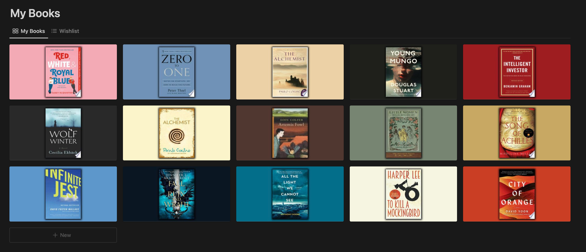

# Notion Auto-filling Reading List

An auto-fill feature for Notion reading lists in Python 3.10.0 using Flask, requests, wand and asyncio.

Fetches book metadata and adds to respective properties in a Notion database. An aesthetic book cover is added as the cover image for each book.

## Generated book covers

## Autofill feature in action

https://github.com/SrvS26/reading_list/assets/92995533/4b703739-b33f-4318-b312-be73e3fbd124

